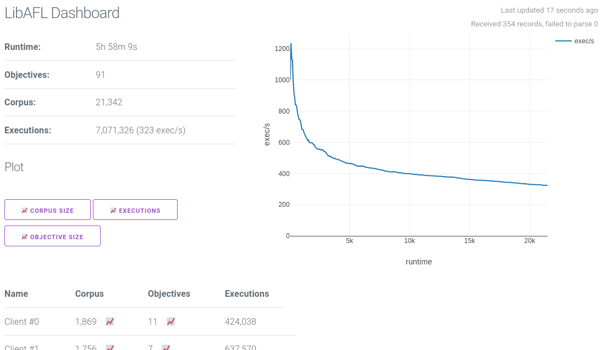

# [WIP] Interactive LibAFL Dashboard
This project aims to create a dashboard for a fuzzing campaign for LibAFL.
Therefore, the OnDiskJSONMonitor must be used.
LibAFL Dashboard then serves a Dashboard via HTTP and continuously reads the logfile.
The data is sent via Websocket, so that the graphs and statistics are computed on the browsers.

The dashboard then shows current live statistics and is able to plot graphs for the different metrics.

At the current state, the dashboard does not save the received data, so for each graph everything must be reloaded.

## Screenshot

## Usage
Use the `OnDiskJSONMonitor` for your [LibAFL](github.com/afLplusplus/libAFL) based fuzzer.
If you just want to try it out, you can use the provided testfile.
Then, start `libafl-dashboard`:
    
    cargo run -- resources/test.jsonl

This serves the dashboard on http://0.0.0.0:9999.
When running on a remote server in the (local) network, use the `--external-hostname HOSTNAME` parameter, to specify the address of the websocket in the served HTML.

By default, the dashboard listens on `0.0.0.0`, this can be changed with the `--host IP` parameter.

As the testfile is not modified, the dashboard does not change its state.

## Credits
This project distributes 
* [plotly.js](https://github.com/plotly/plotly.js) for the graph generation, licensed under MIT License, Copyright (c) 2021 Plotly, Inc
* [milligram.css](https://github.com/milligram/milligram) as simple CSS Framework, licensed under MIT License, Copyright (c) CJ Patoilo <cjpatoilo@gmail.com>

#### License

Licensed under either of <a href="LICENSE-APACHE">Apache License, Version
2.0</a> or <a href="LICENSE-MIT">MIT license</a> at your option.

 

Unless you explicitly state otherwise, any contribution intentionally submitted
for inclusion in this crate by you, as defined in the Apache-2.0 license, shall
be dual licensed as above, without any additional terms or conditions.
